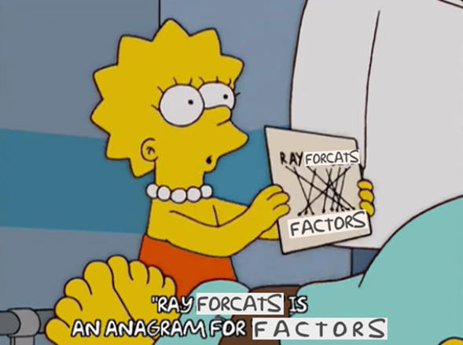

class: inverse, center, middle
name: categoricaldata

# Welcome to your workshop on 
<br>
# Categorical Variables with forcats!

<html><div style='float:left'></div><hr color='#EB811B' size=1px style="width:1000px; margin:auto;"/></html>
---


```{r setup, include=FALSE}
# figures formatting setup
options(htmltools.dir.version = FALSE)
library(knitr)
opts_chunk$set(
  prompt = T,
  fig.align="center", #fig.width=6, fig.height=4.5, 
  # out.width="748px", #out.length="520.75px",
  dpi=300, #fig.path='Figs/',
  cache=F, #echo=F, warning=F, message=F
  engine.opts = list(bash = "-l")
  )

## Next hook based on this SO answer: https://stackoverflow.com/a/39025054
knit_hooks$set(
  prompt = function(before, options, envir) {
    options(
      prompt = if (options$engine %in% c('sh','bash')) '$ ' else 'R> ',
      continue = if (options$engine %in% c('sh','bash')) '$ ' else '+ '
      )
})

library(tidyverse)
library(emojifont)
```
# Introduction `r emo::ji("nerd")`

By now, we already know that **data cleaning** is important. We have realized that treating certain variables is not always so straightforward, and we worry because we know that an inadequate treatment of variables can impact our analysis. 

####  - How many times have you struggle when finding **categorical data** in your datasets? `r emo::ji("sad")`

<br>
<div align="center">

</div>

#### - Do not worry!

* In this workshop we will to show you how to work with **categorical data** using the **`forcats`** tool. 

* It will help you to work **factors**. But more about about in a minute.

---
# Introduction `r emo::ji("nerd")`

### What do we need?

* To install the **`forcats`** package in R.
<br>
<div align="center">

</div>

*OR*

* You can also use **`forcats`** if you have installed the tidyverse.

* Or the development version from GutHub: `devtools::install_github("tidyverse/forcats")`.

---
# What are we covering in this workshop `r emo::ji("check")`

.pull-left-wide[
<br>
<br>
1. [Categorical Data](#categoricaldata)
 
2. [Factors](#factors)
 
3. [**`forcats`**!](#forcats)
 
4. [Some useful functions from **`forcats`**](#functions)
 
5. [AExamples/Exercices](#application)
 
6. [Summary](#summary)
 ]
 
.pull-right-top[
<div align="right">
<br>

<br>
</div>
]

---
class: inverse, center, middle
name: categoricaldata

# Categorical Data

<html><div style='float:left'></div><hr color='#EB811B' size=1px style="width:1000px; margin:auto;"/></html>

---
# Categorical Data `r emo::ji("growth")`

### What is categorical data?

* A set or collection of **categorical variables**.
<br>

### What is a categorical variable? 

* Categorical variables are those that have a fixed and known set of possible values.

* They assign each unit of observation to a particular group or nominal category.

* They represent types of data that may be divided into groups.

* Examples of categorical variables: age, group, gender, educational level, income brackets.

---

# Categorical Data `r emo::ji("growth")`

### Why can categorical variables be problematic?

* They are often stored with different values in a dataset and we need to differentiate category numbers and category labels. 

* We need consistency to work with them properly. `r emo::ji("meh")`

* Thus, we need to know their *true value* not to miss important information. 

<br>
<div align="center">

</div>
---
class: inverse, center, middle
name: factors

# Factors

<html><div style='float:left'></div><hr color='#EB811B' size=1px style="width:1000px; margin:auto;"/></html>

---

# Factors `r emo::ji("clockwise")`

### What are factors?

* A **factor** is an integer vector with **levels attribute** that stores a set of mappings between integers and categorical values.

* Factors are R's data structure for categorical data. In simpler words, **R represents categorical data with factors**.

* R displays not the integers from a variable, but the levels associated with them.

### Why are factors useful?

* Factors in the R language allow to treat character variables in a different way.

* Factors could be easier to work with than characters.

* Factors are helpful for reordering character vectors in non alphabetical order and to improve display.

* They allow to inspect levels in a more detailed way.

* Working with factors is a nicer alternative that working only with dummies.

---
class: inverse, center, middle
name: forcats

# Hello *forcats*!

<html><div style='float:left'></div><hr color='#EB811B' size=1px style="width:1000px; margin:auto;"/></html>

---
# Hello *forcats*! `r emo::ji("cat")`

### Nice Anagram, Hadley!
<br>
<div align="center">

</div>

---
# Hello *forcats*! `r emo::ji("cat")`

### Factors in the concept of tidy data

* The  **`forcats`** package provides useful tools to solve probelms with factors.

* It is better to work with categorical data using tidyverse than with base R. We will see why!

<div align="center">

</div>

---
class: inverse, center, middle
name: functions

# *forcats*: some useful functions

<html><div style='float:left'></div><hr color='#EB811B' size=1px style="width:1000px; margin:auto;"/></html>

---

# Create a new factor: factor()

## **`factor()`**

* Base R has its own function to create factors, **`as.factor`**()

* However, this function lists those factors in alphabetical order, whereas we might want different ways of ordering our factors. 

* Instead, we can use the **`forcats`** function **`factor()`**

---

# Return levels of factors: levels()

## **`levels()`**

* Description

---

#Inspect factors: fct_count()

## **`fct_count()`**

* Description

---

# Change the order of levels: fct_relevel()

## **`fct_relevel`**

* Description

---

# Change the order of levels: fct_reorder()

## **`fct_reorder()`**

* Description

---

# Change the value of levels: fct_collapse()

## **`fct_collapse`**

* Description

---
class: inverse, center, middle
name: resources

# Summary

<html><div style='float:left'></div><hr color='#EB811B' size=1px style="width:1000px; margin:auto;"/></html>

