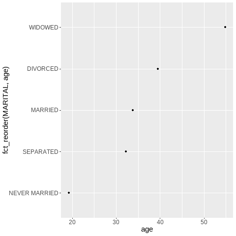
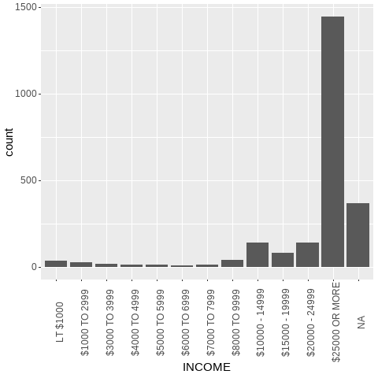
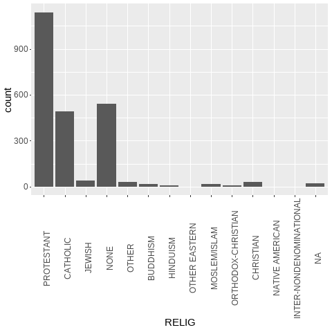
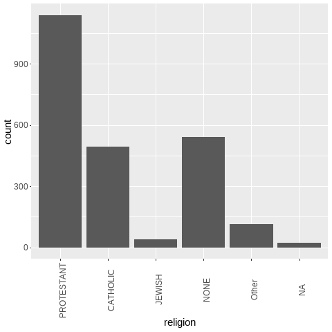

class: inverse, center, middle

# Welcome to your workshop on 
<br>
# Categorical Variables with *forcats*!

<html><div style='float:left'></div><hr color='#EB811B' size=1px style="width:1000px; margin:auto;"/></html>
---


```{r setup, include=FALSE}
# figures formatting setup
options(htmltools.dir.version = FALSE)
library(knitr)
opts_chunk$set(
  prompt = T,
  fig.align="center", #fig.width=6, fig.height=4.5, 
  # out.width="748px", #out.length="520.75px",
  dpi=300, #fig.path='Figs/',
  cache=F, #echo=F, warning=F, message=F
  engine.opts = list(bash = "-l")
  )

## Next hook based on this SO answer: https://stackoverflow.com/a/39025054
knit_hooks$set(
  prompt = function(before, options, envir) {
    options(
      prompt = if (options$engine %in% c('sh','bash')) '$ ' else 'R> ',
      continue = if (options$engine %in% c('sh','bash')) '$ ' else '+ '
      )
})

library(tidyverse)
library(emojifont)
library(foreign)
library(forcats)
library(kableExtra)
```

# What are we covering in this workshop `r emo::ji("check")`

.pull-left-wide[

1. [Introduction](#introduction)

2. [Categorical Data](#categoricaldata)
 
3. [Factors](#factors)
 
4. [**`forcats`**!](#forcats)
 
5. [Some useful functions from **`forcats`** + examples](#functions) 

      * [`factor()`](#factor)
      * [`as_factor()`](#factor)
      * [`fct_relevel()`](#relevel)
      * [`fct_count()`](#count)
      * [`levels()`](#levels)
      * [`fct_reorder()`](#reorder)
      * [`fct_collapse()`](#collapse)
      * [`fct_lump()`](#lump)
 
6. [Summary](#summary)
 ]


---
name: introduction

# Introduction `r emo::ji("nerd")`

By now, we already know that **data cleaning** is important. We have realized that treating certain variables is not always so straightforward, and we worry because we know that an inadequate treatment of variables can impact our analysis. 

####  - How many times have you struggled when finding **categorical data** in your datasets? `r emo::ji("sad")`

<br>
<div align="center">

</div>

#### - Do not worry!

* In this workshop we will to show you how to work with **categorical data** using the **`forcats`** tool. 

* It will help you to work with **factors**. But more about about that in a minute.

---

# Introduction `r emo::ji("nerd")`

### What do we need?

* To install the **`forcats`** package in R.
<br>
<div align="center">

</div>

*OR*

* You can also use **`forcats`** if you have installed the tidyverse.

* Or the development version from GitHub: `devtools::install_github("tidyverse/forcats")`.

---
class: inverse, center, middle
name: categoricaldata

# Categorical Data

<html><div style='float:left'></div><hr color='#EB811B' size=1px style="width:1000px; margin:auto;"/></html>

---
# Categorical Data `r emo::ji("growth")`

### What is categorical data?

* A set or collection of **categorical variables**.
<br>

### What is a categorical variable? 

* Categorical variables are those that have a fixed and known set of possible values.

* They assign each unit of observation to a particular group or nominal category.

* Categorical variables can be used to represent different types of qualitative data.

  * Nominal: two or more categories with no particular order (yes/no, gender, ethnicity).
  
  * Ordinal: ordered or ranked categories (movie ratings, education degrees).
  
  * Interval: intervals between the values of the variable are equally spaced (temperature, weight).

---

# Categorical Data `r emo::ji("growth")`

### Why can categorical variables be problematic?

* They are often stored with different values in a dataset and we need to differentiate category numbers and category labels. 

* We need consistency to work with them properly. `r emo::ji("meh")`

* Thus, we need to know their *true value* not to miss important information. 

<br>
<div align="center">

</div>
---
class: inverse, center, middle
name: factors

# Factors

<html><div style='float:left'></div><hr color='#EB811B' size=1px style="width:1000px; margin:auto;"/></html>

---

# Factors `r emo::ji("letters")`

### What are factors?

* Factors are R's data structure for categorical data: **R represents categorical data with factors**.

* A **factor** is an integer vector with a **levels attribute** that stores a set of mappings between integers and categorical values. [level: all possible 'categories' of a factor] 

* R displays not the integers from a variable, but the levels associated with them.

### Why are factors useful?

* Factors in the R language allow you to treat character variables in a different way.

* Factors could be easier to work with than characters.

* Factors are helpful for reordering character vectors in a non alphabetical order and to improve display.

* They allow you to inspect levels in a more detailed way.

* Working with factors is a nicer alternative that working only with dummies.

---
class: inverse, center, middle
name: forcats

# Hello *forcats*!

<html><div style='float:left'></div><hr color='#EB811B' size=1px style="width:1000px; margin:auto;"/></html>

---
# Hello *forcats*! `r emo::ji("cat")`

### Nice Anagram, Hadley!
<br>
<div align="center">

</div>

---
# Hello *forcats*! `r emo::ji("cat")`

### Factors in the concept of tidy data

* The  **`forcats`** package provides useful tools to solve problems with factors.

* It is better to work with categorical data using tidyverse than with base R. We will see why!

<div align="center">

</div>

---
class: inverse, center, middle
name: functions

# *forcats*: some useful functions

<html><div style='float:left'></div><hr color='#EB811B' size=1px style="width:1000px; margin:auto;"/></html>

---
name: factor

# Create a new factor:  *factor()*, *as_factor()*

## **`factor()`**

### Description

* Base R has its own function to create factors, **`as.factor()`**, which basically encodes a vector as a factor. However, this function lists the levels of the factors in alphabetical order, whereas we might need to order levels in a different way. 

* Instead of using base R, we can use the **`factor()`** function from **`forcats`**.

* **`factor()`** will create an ordered factor with assigned levels.

## **`as_factor()`**

* You can also convert an input to a factor with **`as_factor()`**.

* When x is a character, **`as_factor()`** creates levels in the order in which they appear.

* When x is numeric, the ordering is based on the numeric value.

---

# Create a new factor:  *factor()*, *as_factor()*

#### Let's start from zero to show you how it works:
<br>

```{r}
#Create vector
eu_countries <- c("Poland", "Belgium", "Germany", "Malta", "Italy", "Spain", "Netherlands",
                  "Denmark", "Ireland", "Greece", "France", "Portugal", "Austria",
                  "Finland", "Cyprus", "Czechia", "Estonia", "Hungary", "Latvia",
                  "Lithuania", "Croatia", "Slovakia", "Slovenia", "Sweden", "Bulgaria",
                  "Luxembourg", "Romania")
eu_countries

```

---
# Create a new factor:  *factor()*, *as_factor()*

#### With the base R **`as.factor()`** function our output would be the following:
<br>

```{r}
eu_countries_fct <- as.factor(eu_countries)

eu_countries_fct

```

---
# Create a new factor:  *factor()*, *as_factor()*

#### But... what if we want to see countries ordered by their year of accession to the EU?

* Let's see how it would work with **`factor()`**

```{r}
country_sample <- c(sample(eu_countries, 40, replace = T))

members <- c("Belgium", "France", "Germany", "Italy", "Luxembourg", "Netherlands",
                  "Denmark", "Ireland", "Greece", "Portugal", "Spain", "Austria",
                  "Finland", "Sweden", "Cyprus", "Czechia", "Estonia", "Hungary", "Latvia",
                  "Lithuania", "Malta", "Poland", "Slovakia", "Slovenia", "Bulgaria",
                  "Romania", "Croatia")

factor(country_sample, levels = members)
```

---
name: relevel

# Change levels of factors:  *fct_relevel()*


## **`fct_relevel()`**

### Description

* Factors in R come ordered and unordered. 

* Examples: small, medium, large (ordered); pen, brush, pencil (unorderded).

* If the factor is ordered, then the specific order of the levels matters (small < medium < large).

* If they're not, we need to determine the levels according our needs (maybe pencil, pen, brush?).

* **`fct_relevel()`** is useful to manually change the order in which the levels of a factor will appear. 

---
name: count

#Inspect factors:  *fct_count()*

## **`fct_count()`**

### Description

* This function is useful to count how many times each factor appears in a sample of data.

* It counts the number of values with each level (count entries in a factor).

* Usage: fct_count(f, sort = FALSE, prop = FALSE), where *f* is a factor.

    * If *sort* is TRUE, the most common values float to the top will be shown.
    
    * If *prop* is TRUE, the fraction of marginal table will be computed.

---
#Inspect factors:  *fct_count()*

#### Following our example:

```{r}
#Count the times the name of a country is repeated

fct_count(country_sample) %>%
  head(12)

```
---
name: levels

# Inspect factors:  *levels()*

## **`levels()`**

### Description

* **`levels()`** returns/set the levels of a factor.
 
* This function allows to check all the levels that are stored in a factor, as not all factors might appear in a sample. Before counting with **`fct_count()`**, for instance, we might want to check this.

For this part, we are going to use the **General Social Survey (GSS)** dataset, a product of the National Data Program for the social Sciences from the United States.

* It contains demographic, behavioral, and attitudinal questions, plus topics of special interest from adults. 

* Among the topics covered are civil liberties, crime and violence, intergroup tolerance, morality, national spending priorities, psychological well-being, social mobility, and stress and traumatic events. 

  * So, a lot of categorical data, right?

* You can find it here: https://gss.norc.org/get-the-data

---
# Inspect factors:  *levels()*

## The GSS

```{r, include=FALSE}
#Load dataset
df <- read.spss("GSS2018.sav", use.value.label=TRUE, to.data.frame=TRUE) %>%
  select(INCOME, RELIG, NEWS, TVHOURS, AGE, MARITAL)

```

```{r, echo=FALSE}
df %>% head(10) %>% kbl()
```

---
# Inspect factors:  *levels()*

#### From our GSS data base, we want to see all the levels stored in the income factor: 

```{r}

levels(df$INCOME)

```

#### We also want explore the levels in the religion factor:

```{r}

levels(df$RELIG)

```
---
name: reorder

# Change the order of levels:  *fct_reorder()*

## **`fct_reorder()`**

### Description

* This function will reorder a factor based on the value of another variable, *i.e.*, it will reorder the levels by their relationship with that other variable.

* The argument to use this function is **`fct_reorder(f, x, fun)`**, where *f* is the factor, *x* is the variable according to which the reorder is happening, and *fun* is the function to determine the reordering, with the median being its default.

---
# Change the order of levels:  *fct_reorder()*

#### Let's see how it works.

```{r, include=FALSE}
df_marital <- df %>%
  na.omit(MARITAL) %>%
  group_by(MARITAL) %>%
  summarize(age = mean(as.numeric(AGE), na.rm = T)) %>%
  ggplot(aes(age, MARITAL)) +
  geom_point()

png("marital.png")
print(df_marital)
dev.off()
```

```{r, echo=FALSE}
knitr::include_graphics("./marital.png")
```
---

# Change the order of levels:  *fct_reorder()*

#### Now, look what does **`fct_reorder()`** do: 
.pull-left[
```{r}
#Reorder plot!
df_marriage <- df %>%
  na.omit(MARITAL) %>%
  group_by(MARITAL) %>%
  summarize(age = mean(as.numeric(AGE), na.rm = T)) %>%
  ggplot(aes(age, fct_reorder(MARITAL, age))) +
  geom_point()
```
]

.pull-right[
```{r, include=FALSE}
png("marriage.png")
print(df_marriage)
dev.off()
```

```{r, echo = F}

```
]
---
name: collapse

# Collapse levels:  *fct_collapse()*, *fct_lump()*

* **`forcats`** also allows to collapse factors into other factors.

* This is particularly useful when a factor has too many levels, especially if the level of granularity is too high.

## **`fct_collapse()`**

*  This function collapses levels into manually defined groups.

## **`fct_lump()`**

*  This function lumps levels that do not appear in the top n = number of times into "Other"

---
# Change the value of levels:  *fct_collapse()*

#### Consider the income variable from our GSS as an example:

```{r, include=FALSE}
df_income <- df %>% 
  ggplot(aes(x = INCOME)) +
  geom_bar() +
  theme(axis.text.x = element_text(angle = 90))

png("income.png")
print(df_income)
dev.off()
```

```{r, echo=FALSE}

```

---
# Change the value of levels:  *fct_collapse()*

#### It makes more sense to recategorize the data according to income classes so we use **`fct_collapse()`**:
.pull-left-wide[
```{r}
df_brackets <- df %>%
  mutate(income_brackets = fct_collapse(INCOME, 
    "low" = c("LT $1000", "$1000 TO 2999", "$3000 TO 3999",
    "$4000 TO 4999", "$5000 TO 5999", "$6000 TO 6999",
    "$7000 TO 7999", "$8000 TO 9999", "$10000 - 14999"),
    "middle" = c("$15000 - 19999", "$20000 - 24999"),
    "high" = c("$25000 OR MORE")))
```

]

.pull-right-small[
```{r, include=FALSE}
df_brackets <- df_brackets %>%
  ggplot(aes(x=income_brackets)) +
  geom_bar()

png("brackets.png")
print(df_brackets)
dev.off()
```

```{r, echo=FALSE, out.width="30%", out.height="30%"}
knitr::include_graphics("./brackets.png")
```

```
]

---
name: lump

# Change the value of levels:  *fct_lump()*

#### OR other groupings of data ranges:

```{r, include=FALSE}
df_relig <- df %>% 
  ggplot(aes(x = RELIG)) +
  geom_bar()+
  theme(axis.text.x = element_text(angle = 90))

png("relig1.png")
print(df_relig)
dev.off()
```


```{r, echo=FALSE}

```

---

# Change the value of levels:  *fct_lump()*

#### Lumping levels that appear below a minimum frequency together into a single factor

.pull-left[
```{r}
df_relig_new <- df %>%
  mutate(religion = fct_lump(RELIG, n = 4)) %>%
  group_by(religion) %>%
  ggplot(aes(x = religion)) +
  geom_bar() +
  theme(axis.text.x = element_text(angle = 90))
```
]

.pull-right[
```{r, include=F}
png("relig2.png")
print(df_relig_new)
dev.off()
```

```{r, echo=FALSE}

```
]

---
class: inverse, center, middle
name: summary

# Summary

<html><div style='float:left'></div><hr color='#EB811B' size=1px style="width:1000px; margin:auto;"/></html>

---

# Summary `r emo::ji("document")`

* Factors are R's data structure for categorical data.

* Categorical data is a set or collection of categorical variables.

* Categorical variables assign units of observation (levels) to a particular category.

* Factors reorder character vectors in non alphabetical order and improve display.

* They allow to inspect levels in a more detailed way.

* The **`forcats`** package provides useful tools to solve problems with factors.

---
# Summary `r emo::ji("document")`

### Summary of **`forcats`** functions.
<br>

```{r, include=FALSE}
tab1 <- matrix(c('factor()', 'as_factor()', 'fct_relevel()', 'fct_count()', 'fct_unique()', 'levels()', 'fct_reorder()', 'fct_collapse()', 'fct_lump()'), ncol=1, byrow=TRUE)
colnames(tab1) <- c('Function')
rownames(tab1) <- c('1','2','3','4','5','6','7','8', '9')
tab1 <- as.table(tab1)


tab2 <- matrix(c('Creates an ordered factor with assigned levels', 'Converts an input to a factor', 'Reorders de the levels of a factor', 'Counts entries in a factor', 'Removes duplicates', 'Returns the levels of a factor', 'Reorders a factor based on the value of another variable', 'Collapses levels into defined groups', 'Lumps together factor levels into "Other"'), ncol=1, byrow=TRUE)
colnames(tab2) <- c('Description')
rownames(tab2) <- c('','','','','','','','','')
tab2 <- as.table(tab2)

tab_factors <- cbind(tab1,tab2)

factors_output <- knitr::kable(tab_factors) %>%
kableExtra::kable_styling(bootstrap_options = "striped", font_size = 20)

```

```{r, echo=FALSE}
factors_output
```
---
class: inverse, center, middle
name:

# Thank you! `r emo::ji("wave")`

<html><div style='float:left'></div><hr color='#EB811B' size=1px style="width:1000px; margin:auto;"/></html>

---